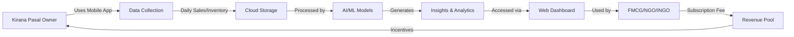
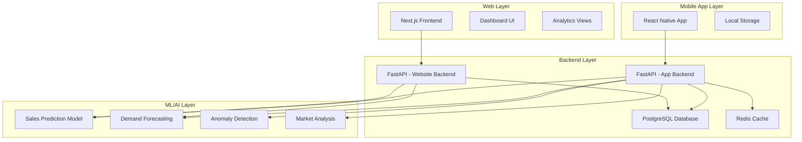

# 🛒 Pasale - Retail Intelligence Platform

> **Empowering Local Retailers, Enabling Data-Driven Decisions**

Pasale is a comprehensive retail data collection and intelligence platform designed for Nepal's local retail sector (Kirana Pasals). We bridge the gap between traditional retail stores and modern data analytics by collecting real-time retail data through a mobile app and providing actionable insights to FMCG companies, NGOs, and INGOs through our advanced AI-powered analytics platform.

---

## 📋 Table of Contents

- [Overview](#overview)
- [Key Features](#key-features)
- [How It Works](#how-it-works)
- [Architecture](#architecture)
- [Technology Stack](#technology-stack)
- [Project Structure](#project-structure)
- [Getting Started](#getting-started)
  - [Prerequisites](#prerequisites)
  - [Installation](#installation)
  - [Running the Application](#running-the-application)
- [Incentive System](#incentive-system)
- [API Documentation](#api-documentation)
- [Contributing](#contributing)
- [License](#license)

---

## 🎯 Overview

### The Problem
Local retail stores (Kirana Pasals) in Nepal hold valuable market data, but lack the tools to collect, analyze, and monetize it. Meanwhile, FMCG companies, NGOs, and INGOs struggle to get accurate, real-time insights from the retail sector.

### Our Solution
Pasale provides:
- **For Retailers**: A simple mobile app to track sales, inventory, and earn rewards
- **For Businesses**: Access to verified, real-time retail data and AI-powered insights
- **For the Ecosystem**: A sustainable, incentive-based data marketplace

---

## ✨ Key Features

### 📱 Mobile App (For Kirana Pasals)
- **Easy Data Entry**: Simple interface to record daily sales, inventory, and purchases
- **Real-time Sync**: Automatic cloud synchronization of retail data
- **Reward System**: Earn points and travel vouchers for consistent data contribution
- **Offline Support**: Work without internet; sync when connected
- **Multi-language**: Support for Nepali and English

### 🌐 Web Platform (For Data Consumers)
- **Interactive Dashboard**: Visualize retail trends, sales patterns, and market insights
- **AI-Powered Analytics**: 
  - Sales forecasting
  - Demand prediction
  - Market trend analysis
  - Product performance insights
- **Custom Reports**: Generate tailored reports for specific products, regions, or timeframes
- **Data Export**: Download data in various formats (CSV, Excel, PDF)
- **Subscription Plans**: Flexible pricing for different organization sizes

### 🤖 AI/ML Models
- **Sales Prediction**: Forecast future sales based on historical trends
- **Demand Forecasting**: Predict product demand across regions
- **Anomaly Detection**: Identify unusual patterns in retail data
- **Market Segmentation**: Cluster similar retailers and buying behaviors
- **Price Optimization**: Suggest optimal pricing strategies

---

## 🔄 How It Works



1. **Data Collection**: Kirana Pasal owners input daily sales and inventory data through our mobile app
2. **Data Processing**: Data is securely stored and processed through our AI/ML pipeline
3. **Insight Generation**: Our models generate actionable insights, forecasts, and reports
4. **Data Access**: FMCG companies, NGOs, and INGOs access insights through the web dashboard
5. **Incentive Distribution**: Retailers earn points and rewards based on data quality and consistency

---

## 🏗️ Architecture

### System Architecture



### Tech Stack Overview

| Component | Technology |
|-----------|-----------|
| **Mobile App** | React Native, Expo |
| **Web Frontend** | Next.js 16, React 19, TypeScript, Tailwind CSS |
| **Backend APIs** | FastAPI, Python 3.10+ |
| **Database** | PostgreSQL, Alembic (migrations) |
| **Caching** | Redis |
| **ML/AI** | Scikit-learn, TensorFlow, Pandas, NumPy |
| **Authentication** | JWT, OAuth2 |
| **Cloud Storage** | AWS S3 / Google Cloud Storage |
| **Deployment** | Docker, Kubernetes |

---

## 📁 Project Structure

```plaintext
Startup-Hackathon-Embark/
│
├── app/                          # Mobile Application
│   ├── frontend/
│   │   └── pasale/              # React Native Mobile App
│   │       ├── src/             # Source code
│   │       ├── assets/          # Images, fonts, etc.
│   │       └── package.json     # Dependencies
│   │
│   └── pasale-backend/          # Mobile App Backend API
│       ├── app/
│       │   ├── api/             # API endpoints
│       │   │   └── v1/          # API v1 routes
│       │   │       ├── ml.py    # ML model endpoints
│       │   │       └── __init__.py
│       │   ├── core/            # Core configurations
│       │   ├── models/          # Database models
│       │   └── services/        # Business logic
│       ├── scripts/             # Utility scripts
│       │   └── verify_ml_models.py
│       ├── alembic/             # Database migrations
│       ├── requirements.txt     # Python dependencies
│       └── README.md
│
├── website/                      # Web Platform
│   ├── pasale-frontend/         # Next.js Web Dashboard
│   │   ├── app/                 # Next.js app directory
│   │   ├── components/          # React components
│   │   ├── public/              # Static assets
│   │   └── package.json         # Dependencies
│   │
│   └── Backend/                 # Website Backend API
│       ├── api/                 # API endpoints
│       ├── models/              # Database models
│       └── requirements.txt     # Python dependencies
│
└── README.md                     # This file
```

---

## 🚀 Getting Started

### Prerequisites

Before you begin, ensure you have the following installed:

- **Node.js** (v18.x or higher)
- **Python** (3.10 or higher)
- **PostgreSQL** (14.x or higher)
- **Redis** (6.x or higher)
- **npm** or **yarn**
- **Git**

For mobile development:
- **Expo CLI**: `npm install -g expo-cli`
- **Android Studio** (for Android) or **Xcode** (for iOS)

---

### Installation

#### 1. Clone the Repository

```bash
git clone https://github.com/yourusername/Startup-Hackathon-Embark.git
cd Startup-Hackathon-Embark
```

#### 2. Setup Mobile App Backend

```bash
# Navigate to the backend directory
cd app/pasale-backend

# Create virtual environment
python -m venv venv

# Activate virtual environment
# On Windows:
venv\Scripts\activate
# On macOS/Linux:
source venv/bin/activate

# Install dependencies
pip install -r requirements.txt

# Setup environment variables
cp .env.example .env
# Edit .env with your configuration

# Run database migrations
alembic upgrade head
```

#### 3. Setup Mobile App Frontend

```bash
# Navigate to mobile app directory
cd app/frontend/pasale

# Install dependencies
npm install

# Setup environment variables
cp .env.example .env
# Edit .env with your configuration
```

#### 4. Setup Website Backend

```bash
# Navigate to website backend directory
cd website/Backend

# Create virtual environment
python -m venv venv

# Activate virtual environment
# On Windows:
venv\Scripts\activate
# On macOS/Linux:
source venv/bin/activate

# Install dependencies
pip install -r requirements.txt

# Setup environment variables
cp .env.example .env
# Edit .env with your configuration
```

#### 5. Setup Website Frontend

```bash
# Navigate to website frontend directory
cd website/pasale-frontend

# Install dependencies
npm install

# Setup environment variables
cp .env.example .env.local
# Edit .env.local with your configuration
```

---

### Running the Application

#### 🔧 Start Backend Services

**Terminal 1 - Mobile App Backend:**
```bash
cd app/pasale-backend
venv\Scripts\activate  # On Windows
# source venv/bin/activate  # On macOS/Linux

# Start the server
uvicorn app.main:app --reload --host 0.0.0.0 --port 8000
```
Access at: `http://localhost:8000`
API Docs: `http://localhost:8000/docs`

**Terminal 2 - Website Backend:**
```bash
cd website/Backend
venv\Scripts\activate  # On Windows
# source venv/bin/activate  # On macOS/Linux

# Start the server
uvicorn main:app --reload --host 0.0.0.0 --port 8001
```
Access at: `http://localhost:8001`
API Docs: `http://localhost:8001/docs`

#### 🌐 Start Frontend Services

**Terminal 3 - Website Frontend:**
```bash
cd website/pasale-frontend

# Start development server
npm run dev
```
Access at: `http://localhost:3000`

**Terminal 4 - Mobile App:**
```bash
cd app/frontend/pasale

# Start Expo development server
npm start
# or
expo start
```

Then:
- Press `a` to open Android emulator
- Press `i` to open iOS simulator
- Scan QR code with Expo Go app on your phone

#### 🗄️ Start Database Services

**Terminal 5 - PostgreSQL:**
```bash
# Make sure PostgreSQL is running
# On Windows (if running as service):
# Services are automatically started

# On macOS:
brew services start postgresql

# On Linux:
sudo systemctl start postgresql
```

**Terminal 6 - Redis:**
```bash
# On Windows:
redis-server

# On macOS:
brew services start redis

# On Linux:
sudo systemctl start redis
```

---

## 🎁 Incentive System

### How Retailers Earn Rewards

Retailers using the Pasale mobile app earn points through:

1. **Daily Data Entry**: Points for entering daily sales and inventory
2. **Data Accuracy**: Bonus points for consistent, accurate data
3. **Streak Bonuses**: Extra points for consecutive days of data entry
4. **Milestone Rewards**: Special rewards at 30, 60, 90 days

### Reward Tiers

| Points | Reward Tier | Benefits |
|--------|-------------|----------|
| 0-500 | Bronze | 5% discount on travel vouchers |
| 501-1000 | Silver | 10% discount + Priority support |
| 1001-2000 | Gold | 15% discount + Premium features |
| 2001+ | Platinum | 20% discount + Exclusive benefits |

### Redemption Options

- **Travel Vouchers**: Redeem points for bus, flight, and hotel vouchers
- **Business Tools**: Get inventory management tools and supplies
- **Training**: Access to free business workshops and training
- **Cash Back**: Convert points to mobile wallet balance

---

## 📊 API Documentation

### Mobile App Backend API
- **Base URL**: `http://localhost:8000/api/v1`
- **Swagger Docs**: `http://localhost:8000/docs`
- **ReDoc**: `http://localhost:8000/redoc`

### Website Backend API
- **Base URL**: `http://localhost:8001/api`
- **Swagger Docs**: `http://localhost:8001/docs`
- **ReDoc**: `http://localhost:8001/redoc`

### Key Endpoints

#### Mobile App API
```
POST   /api/v1/auth/register     # Register new retailer
POST   /api/v1/auth/login        # Login
POST   /api/v1/sales             # Record sales data
GET    /api/v1/sales             # Get sales history
POST   /api/v1/inventory         # Update inventory
GET    /api/v1/rewards           # Get reward points
POST   /api/v1/rewards/redeem    # Redeem rewards
```

#### Website API
```
POST   /api/auth/login           # Login for data consumers
GET    /api/analytics/sales      # Get sales analytics
GET    /api/analytics/forecasts  # Get AI predictions
POST   /api/ml/predict-demand    # Demand forecasting
GET    /api/reports              # Generate reports
POST   /api/subscriptions        # Manage subscriptions
```

---

## 🤖 ML Models

### Available Models

1. **Sales Prediction**
   - Predicts future sales based on historical data
   - Endpoint: `/api/v1/ml/predict-sales`

2. **Demand Forecasting**
   - Forecasts product demand across regions
   - Endpoint: `/api/v1/ml/forecast-demand`

3. **Anomaly Detection**
   - Identifies unusual sales patterns
   - Endpoint: `/api/v1/ml/detect-anomalies`

4. **Market Segmentation**
   - Clusters retailers by behavior
   - Endpoint: `/api/v1/ml/segment-market`

### Verify ML Models

```bash
cd app/pasale-backend
python scripts/verify_ml_models.py
```

---

## 🧪 Testing

### Backend Tests
```bash
# Mobile app backend
cd app/pasale-backend
pytest

# Website backend
cd website/Backend
pytest
```

### Frontend Tests
```bash
# Website frontend
cd website/pasale-frontend
npm test
```

---

## 🚢 Deployment

### Using Docker

```bash
# Build all services
docker-compose build

# Start all services
docker-compose up -d

# Stop all services
docker-compose down
```

### Production Build

**Website:**
```bash
cd website/pasale-frontend
npm run build
npm start
```

**Backend:**
```bash
cd app/pasale-backend
gunicorn app.main:app --workers 4 --worker-class uvicorn.workers.UvicornWorker --bind 0.0.0.0:8000
```

---

## 📈 Roadmap

- [x] MVP Mobile App
- [x] Basic Web Dashboard
- [x] AI/ML Models Integration
- [x] Incentive System
- [ ] Payment Gateway Integration
- [ ] Advanced Analytics
- [ ] Multi-tenant Support
- [ ] Mobile App (iOS)
- [ ] API Rate Limiting
- [ ] Advanced Security Features

---

## 🤝 Contributing

We welcome contributions! Please see our [Contributing Guidelines](CONTRIBUTING.md) for details.

1. Fork the repository
2. Create your feature branch (`git checkout -b feature/AmazingFeature`)
3. Commit your changes (`git commit -m 'Add some AmazingFeature'`)
4. Push to the branch (`git push origin feature/AmazingFeature`)
5. Open a Pull Request

---

## 📝 License

This project is licensed under the MIT License - see the [LICENSE](LICENSE) file for details.


## 🙏 Acknowledgments

- Thanks to all Kirana Pasal owners who participated in our pilot program
- FMCG partners for their valuable feedback
- Open source community for amazing tools and libraries

---

**Made with ❤️ for Nepal's Retail Sector**
